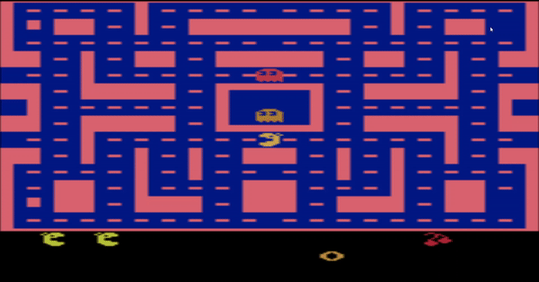

# Pacman_RL



 ## Solve Pacman game using Reinforcement Learning

Three models were built: simple Deep Q-Network, Noisy Double Dueling DQN and N-step Double Dueling DQN.
Simple DQN and N-step Double Dueling DQN using keras-rl framework. 
Keras-rl is very simple, however, It exhibits some issues in versions, so please don't do pip install keras-rl, otherwise some imports will not work.
You will find keras-rl source code in this repo, no need to import the librabry.
The second model, Noisy Double Dueling DQN, was built from scratch.
To test a model, you only need to specify the path in the test.py script and then ```python3 /path/to/test.py```. We used python 3.7.1.
Finally, you'll find below a list of dependencies, requiered to launch the project:
- atari-py==0.1.7 
- gym==0.11.0 
- h5py==2.8.0 
- keras==2.2.4  
- numpy==1.16.1
- tensorflow==1.13.0

